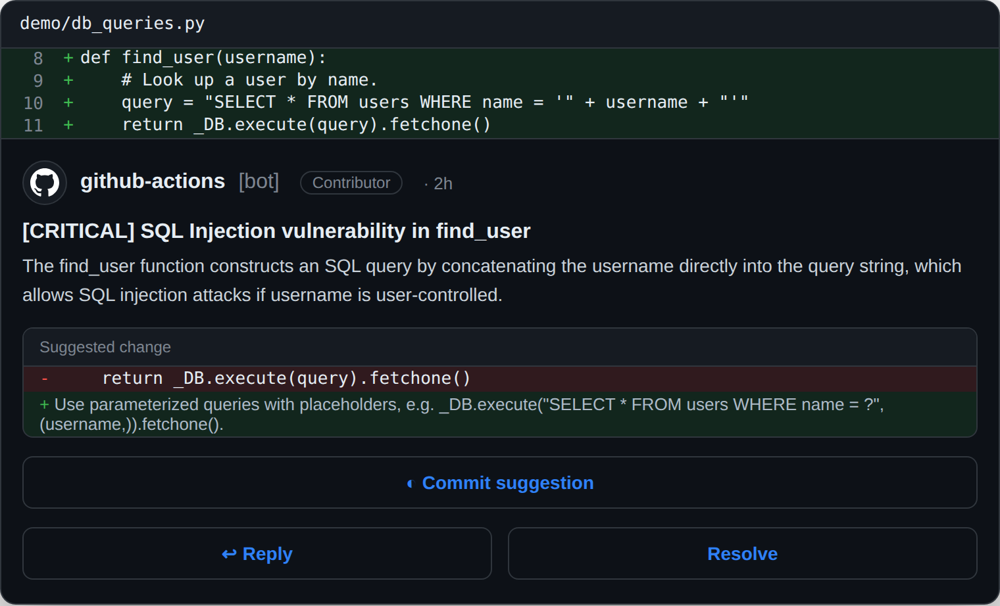
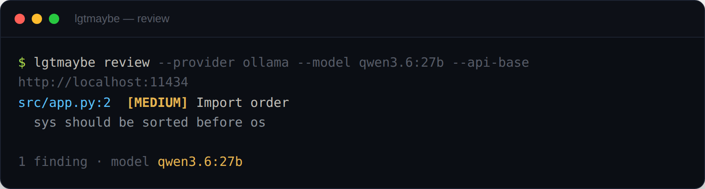

<p align="center">
  
</p>

# lgtmaybe

Provider-agnostic PR reviewer. Six providers, one flag, no static keys for
cloud providers. Posts inline review comments and a summary.

📖 **Full documentation:** <https://mattjcoles.github.io/lgtmaybe/>

## What it reviews

lgtmaybe fetches the PR diff from the GitHub API and reviews the lines a pull
request changes. It never checks out or runs your code. To judge each change in
context it also reads a few surrounding lines from the file, but it only ever
comments on what the PR actually changed, not the whole repository.

Reviews surface the kind of thing a careful reviewer would flag, each graded from
`info` up to `critical`: **logic and correctness bugs** (edge cases, null
dereferences, off-by-one and boundary errors, mismatched ranges, unhandled error
paths), **missing tests** for changed code paths (with a suggested test to drop
in), and **undocumented public APIs**. The model is prompted with an
**OWASP-aligned security checklist** — injection, XSS, hardcoded secrets, broken
authn/authz, path traversal, SSRF, insecure deserialization, weak crypto,
resource/DoS safety, and secrets or PII (passwords, tokens, SSNs, card data)
leaking into logs — so security findings are first-class, not an afterthought. It
also flags **factually outdated** code — deprecated APIs and end-of-life or
vulnerable dependencies — when the diff shows them, **performance regressions**
(N+1 queries, accidentally quadratic work, redundant computation, allocations or
blocking I/O on hot paths, unbounded queries), and needless **complexity** (deep
nesting / high cyclomatic complexity, over-long functions, duplicated logic).
Generated and non-reviewable
files (lockfiles, minified bundles, vendored directories, binaries) are skipped
automatically, and secrets are redacted from the diff before it is sent to the
model.

**Hardened against malicious PRs.** lgtmaybe never checks out or runs PR code,
treats the diff as untrusted input, defends against prompt injection (including
forged delimiter break-out attempts), and redacts a broad set of secret formats
(cloud keys, GitHub/Slack/Google/Stripe tokens, private keys, passwords, and
credentials in connection strings) before anything leaves your environment. See
[Data and Privacy](docs/explanation/data-and-privacy.md).

**How the scope is bounded.** Every run is capped so a large PR can't blow up
latency:

- `max_files` (default 50) — reviews the top-N changed files and notes how many were skipped.
- `max_input_tokens` (default 100k) — batches the diff to fit the model's budget.
- `categories` (default all seven) — which review lenses to run; each is a concurrent model call, so narrowing the list means fewer calls.
- `min_severity` (default `info`) plus `include_paths` / `exclude_paths` — focus the review on what you care about.

See [Configure .lgtmaybe.yml](docs/how-to/configure-lgtmaybe-yml.md) for every knob.

**What you get back.** Each finding is structured data — file, line, severity, a
title, an explanation, and an optional suggested fix — so it renders the same
everywhere:

- **On a GitHub PR** — an inline comment on the exact changed line for each finding, plus one summary comment naming the model used. Re-running updates the same comments instead of duplicating them, and a clean PR gets a 👍 **LGTM!**.
- **On the CLI** — `lgtmaybe review` reads your local `git` diff and prints the findings (a readable listing, a JSON array with `--json`, or `--format agent` for an AI coding agent to read and apply); nothing is posted to GitHub.

<p align="center">
  
</p>

<p align="center"><em>On a GitHub PR — an inline comment on the changed line. The same findings on the CLI:</em></p>

<p align="center">
  
</p>

A fuller walkthrough with example output is in
[What gets reviewed](docs/explanation/what-gets-reviewed.md).

## Quick start (60 seconds, local, zero cost)

From inside a git repo, on a branch with changes, review your diff against the
default branch and print the findings:

```bash
pip install lgtmaybe

lgtmaybe review \
  --provider ollama \
  --model qwen3.6:27b \
  --api-base http://localhost:11434
```

No GitHub token and no pull request needed — `lgtmaybe review` reads your local
`git` diff and prints the findings. To post reviews on real pull requests, wire
up the [GitHub Action](#use-as-a-github-action). See
[Getting Started](docs/tutorial/getting-started.md) for the full walkthrough.

## Providers

| Provider | Auth |
|---|---|
| `openai` | `OPENAI_API_KEY` |
| `anthropic` | `ANTHROPIC_API_KEY` |
| `openrouter` | `OPENROUTER_API_KEY` |
| `bedrock` | Ambient AWS creds — GitHub OIDC, no static key |
| `vertex` | Ambient GCP creds — Workload Identity Federation, no key |
| `azure` | Ambient Azure AD creds — GitHub OIDC, no static key (or `AZURE_API_KEY`) + endpoint |
| `ollama` | None — local only, zero cost |

## Documentation

Browse the rendered docs at <https://mattjcoles.github.io/lgtmaybe/>, or read the
Markdown sources below.

**Tutorial** — learn by doing

- [Getting Started](docs/tutorial/getting-started.md) — your first review with ollama

**How-to guides** — task recipes

- [Run locally with ollama](docs/how-to/run-locally-with-ollama.md)
- [Review with Bedrock OIDC](docs/how-to/review-with-bedrock-oidc.md)
- [Review with Vertex WIF](docs/how-to/review-with-vertex-wif.md)
- [Review with Azure OpenAI](docs/how-to/review-with-azure.md)
- [Use as a GitHub Action](docs/how-to/use-as-github-action.md)
- [Configure .lgtmaybe.yml](docs/how-to/configure-lgtmaybe-yml.md)
- [Releasing (maintainers)](docs/how-to/releasing.md)

**Reference** — look things up

- [Configuration Reference](docs/reference/config.md) — all config fields and schemas (generated)

**Explanation** — understand the design

- [What gets reviewed](docs/explanation/what-gets-reviewed.md) — scope, caps, and what the output looks like
- [Architecture](docs/explanation/architecture.md) — ports and adapters, the review pipeline
- [Auth Model](docs/explanation/auth-model.md) — why keyless cloud, how credential resolution works
- [Data and Privacy](docs/explanation/data-and-privacy.md) — what is sent where, secret redaction, ollama local mode
- [Trust and Cost](docs/explanation/trust-and-cost.md) — choosing who reviews run for (everyone, trusted contributors, or admins) and the small cost angle

## Use as a GitHub Action

```yaml
name: lgtmaybe

on:
  pull_request_target:
  issue_comment:
    types: [created]

permissions:
  contents: read
  pull-requests: write

jobs:
  review:
    if: ${{ github.event_name == 'pull_request_target' || github.event.issue.pull_request }}
    runs-on: ubuntu-latest
    steps:
      - uses: actions/checkout@v4
      - uses: lgtmaybe/lgtmaybe@v1
        with:
          provider: openai
          model: gpt-5.5
          api_key: ${{ secrets.OPENAI_API_KEY }}
```

Copy-paste workflows for every cloud and API-key provider live in
[`examples/workflows/`](examples/workflows/). Cloud providers (Bedrock, Vertex,
Azure) are **keyless** — pass `aws_role_arn` / `gcp_wif_provider` /
`azure_client_id` and the action does the OIDC/WIF exchange for you (needs
`id-token: write`). See
[Use as a GitHub Action](docs/how-to/use-as-github-action.md). ollama is local
only — run it through the [CLI](docs/how-to/run-locally-with-ollama.md) instead.

> **🔧 Choose who can trigger reviews.** You decide who reviews run for —
> everyone, trusted contributors, or just admins. The example workflows default
> to trusted contributors (`OWNER`, `MEMBER`, `COLLABORATOR`), and it's a
> one-line change to open it up or tighten it. With ollama this is free; on a
> hosted provider it also keeps token spend predictable. See
> [Who can trigger a review](docs/how-to/use-as-github-action.md#who-can-trigger-a-review)
> and [Trust and Cost](docs/explanation/trust-and-cost.md).

## Distribution

- **CLI** — `pip install lgtmaybe`
- **GitHub Action** — `uses: lgtmaybe/lgtmaybe@v1`

## Contributing

Test-first, green CI, scope is the gate. See [CONTRIBUTING.md](CONTRIBUTING.md).

## License

MIT — see `LICENSE`.
